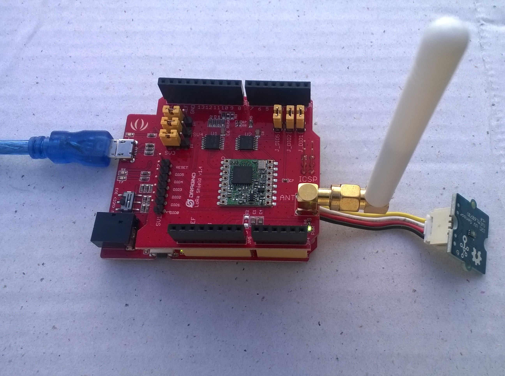

# FieldGateway.LoRa.DuinoClientUV
Sample UV Sensor monitor for my [LoRa](https://lora-alliance.org/) field gateway projects

I used the [Arduino-Lora](https://github.com/sandeepmistry/arduino-LoRa) & [Seeedstudion VEML6070](https://github.com/Seeed-Studio/Seeed_VEML6070) libraries, thank you to the authors Sandeep Mistry & Seeedstudio.

Device options

* [Arduino Uno R3](https://www.seeedstudio.com/Arduino-Uno-Rev3-p-2995.html)
* [Seeeduno V4.2](https://www.seeedstudio.com/Seeeduino-V4-2-p-2517.html)

LoRa shield options tested

* [Dragino 433/868/915Mz](http://www.dragino.com/products/lora/item/102-lora-shield.html)

* [Elecrow 915MHz](https://www.elecrow.com/lora-rfm95-shield-915mhz.html)

* [MakerFabs 433MHz](https://makerfabs.com/index.php?route=product/product&product_id=131)

* [MakerFabs 868MHz](https://makerfabs.com/index.php?route=product/product&product_id=130)

Extras

* [SeeedStudio Grove - I2C UV Sensor (VEML6070)](https://www.seeedstudio.com/Grove-I2C-UV-Sensor-VEML607-p-3195.html)
* [SeeedStudio Grove-4 pin Male Jumper to Grove 4 pin Conversion Cable](https://www.seeedstudio.com/Grove-4-pin-Male-Jumper-to-Grove-4-pin-Conversion-Cable-5-PCs-per-Pac-p-1565.html)

